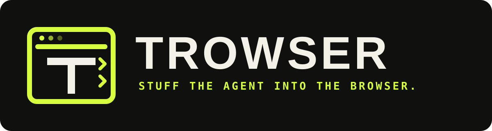

<p align="center">
  
</p>

<h1 align="center">Trowser</h1>

<p align="center"><strong>A browser-native local agent runtime for Chrome.</strong></p>


<p align="center">
  Run an AI agent on the page you are looking at, with a model that runs on your own hardware.<br />
  No cloud agent service. No API key required. No page content leaving the device.
</p>

---

## The idea

Most browser agents work by shipping your browser to the model: a remote service drives a
headless browser, or your DOM is streamed to a hosted model that decides what to click.

Trowser inverts that. The model session, the observation loop, the policy engine and the
browser tools all live *inside* Chrome.

> Stop sending your browser to the agent. Stuff the agent into the browser.

```
┌───────────────────────────── CHROME ─────────────────────────────┐
│                                                                  │
│  Active tab                          Trowser side panel          │
│  ┌──────────────────────┐            ┌────────────────────────┐  │
│  │ Page DOM             │  snapshot  │  observe               │  │
│  │ content bridge       │───────────►│  decide                │  │
│  │                      │            │  validate              │  │
│  │ grounded elements    │◄───────────│  assess (policy)       │  │
│  │ action executor      │   action   │  approve (you)         │  │
│  └──────────────────────┘            │  act                   │  │
│                                      └───────────┬────────────┘  │
│                                                  │               │
│                         ┌────────────────────────┴─────────────┐ │
│                         │ Inference, your choice of:           │ │
│                         │  1. Chrome built-in AI (on-device)   │ │
│                         │  2. WebLLM / WebGPU (in this tab)    │ │
│                         │  3. Ollama (localhost daemon)        │ │
│                         │  4. Any OpenAI-compatible endpoint   │ │
│                         └──────────────────────────────────────┘ │
└──────────────────────────────────────────────────────────────────┘
```

## Backends

Trowser is backend-agnostic. Pick whichever suits the machine, and switch at any time.

| Backend | Install | Runs where | Good for |
|---|---|---|---|
| **Chrome built-in AI** | nothing | On-device, managed by Chrome | Zero-setup. Chrome 138+ desktop |
| **WebLLM** | nothing | In the browser tab, on WebGPU | Fully in-browser, weights cached from Hugging Face |
| **Ollama** | Ollama daemon | localhost | Best quality per gigabyte, huge model library |
| **OpenAI-compatible** | any server | localhost or remote | LM Studio, llama.cpp, vLLM, Jan, LocalAI, HF router |

`Auto` walks that list in order and uses the first one that actually works, so a fresh
install does something useful with whatever the machine already has.

### Ollama

Ollama refuses cross-origin requests from origins it does not know, and a Chrome extension
origin is not allowed by default. Start it with the extension permitted:

```bash
OLLAMA_ORIGINS="chrome-extension://*" ollama serve
```

On Windows:

```bash
setx OLLAMA_ORIGINS "chrome-extension://*"
```

Then restart Ollama. Trowser reports this exact remedy if the connection is refused.

### Hugging Face

Trowser can pull models straight from the Hub:

- **Search** GGUF and MLC repositories from the options page.
- **Pull GGUF into Ollama** with one click; Trowser resolves the best quantisation and
  issues `ollama pull hf.co/<org>/<repo>:<quant>`.
- **WebLLM weights** are fetched and cached from the Hub automatically.
- **Gated repos and rate limits** are handled by adding a token in options.
- **HF router** works as an OpenAI-compatible endpoint at `https://router.huggingface.co/v1`.

## Install

Download the latest `trowser-*.zip` from [Releases](https://github.com/eoinjordan/trowser/releases),
or build it yourself:

```bash
npm ci
npm run build
```

Then in Chrome:

1. Open `chrome://extensions`
2. Enable **Developer mode**
3. **Load unpacked** and select `dist/`
4. Open any normal web page and press the Trowser icon (or `Ctrl+Shift+U`)

## Use it

Type what you want done with the current tab:

```
Find the pricing table and tell me which plan includes SSO.
```

Trowser then repeats:

```
observe → decide locally → validate → assess risk → ask you if needed → act
```

Every step is visible in the trace. Nothing consequential happens without your approval.

## Security model

The design principle is **capability before autonomy**. A web page is untrusted input that
can contain text written to manipulate a model, so page content is treated as data and
never as instructions.

**The model cannot express a dangerous action, because the vocabulary does not contain one.**

- Actions are grounded to generated element ids (`e7`), never CSS selectors.
  A hallucinated id is rejected before it reaches the page.
- There is no JavaScript-evaluation tool, and no arbitrary-selector tool.
- `javascript:`, `data:` and `file:` URLs are rejected at validation time.
- Cross-origin navigation is off by default.

**Hard blocks that no configuration can turn off:**

- Typing into password or file inputs.
- Typing anything that looks like a payment card (Luhn-checked), API key, private key,
  IBAN or national identifier.
- Password values are never read into a snapshot, not even redacted.

**Approval gates:**

- *Destructive* controls (delete, remove, revoke, close account, sign out) always stop for
  a human, on every site, including trusted ones.
- *Consequential* controls (pay, order, submit, send, publish, book, apply) require approval
  unless you have explicitly trusted that origin.
- Form submission and Enter-to-submit are treated as consequential.

**Containment:**

- `activeTab` rather than a standing `<all_urls>` content-script grant.
- Host permissions for backends are *optional* and requested only when used.
- Bounded observation: capped element count and page-text budget.
- Step limits, plus loop detection that stops an agent repeating itself.
- Prompt-injection attempts in page text are detected and flagged to both you and the model.

The policy engine is a pure function and is covered by its own test suite, so its behaviour
is pinned rather than assumed. See [docs/SECURITY.md](docs/SECURITY.md) for the threat model
and the honest list of what is *not* yet solved.

## Development

```bash
npm ci
npm run watch      # rebuild on change
npm test           # 230+ unit tests, node:test
npm run typecheck  # strict TypeScript, sources and tests
npm run validate   # checks the built dist/ before it ships
npm run verify     # typecheck + test + build + validate
npm run package    # reproducible zip + sha256
```

### Testing

Everything that can be tested without a browser is pure and tested:

| Suite | Covers |
|---|---|
| `schema` | action validation, grounding, URL scheme blocking, clamping |
| `policy` | risk classification, hard blocks, secret detection, trusted origins |
| `jsonrepair` | recovering JSON from small-model output |
| `prompt` | prompt assembly, injection detection, budgets |
| `settings` | settings coercion, clamping, secret redaction |
| `loop` | full agent control flow: retries, approval, loop detection, aborts |
| `oauth` | OAuth callback parsing, state validation, device flow |
| `hf` | Hub URL building, GGUF quantisation resolution |
| `zip` | archive writer, verified by reading the archive back |

The agent loop is tested against injected fakes, so retry, approval and termination
behaviour is verified without a model or a browser.

### Layout

```
src/
├── core/          policy, schema, prompt, settings, json repair   (pure, no chrome APIs)
├── llm/           chrome-ai, webllm, ollama, openai-compatible, http
├── integrations/  hugging face, oauth, sign-in
├── agent/         the observe/decide/act loop
├── tools/         side-panel half of the page bridge
├── content.ts     page bridge: snapshot + action executor
├── background.ts  service worker (lifecycle only)
├── sidepanel.*    agent UI
└── options.*      settings UI
```

The agent loop deliberately runs in the side-panel document rather than the service worker,
because Chrome's Prompt API and WebGPU are available to extension documents but not to
service workers.

## Accounts (optional)

Trowser has no backend, so sign-in exists only to back up your settings and saved skills.

- **GitHub** — a personal access token with the `gist` scope works with no setup. A device
  flow is also supported if you register an OAuth app.
- **Google** — implicit flow through `chrome.identity`, using an OAuth client ID you register.

Tokens are stored in `chrome.storage.local` for this browser profile only, are never written
to the trace, and are sent only to the provider they belong to.

## Status

v0.2 is a working prototype with a real policy engine and a real test suite. It is not an
unattended automation system, and it should not be pointed at your bank. Keep a human in the
loop for anything consequential.

See [docs/ROADMAP.md](docs/ROADMAP.md).

## License

MIT. See [LICENSE](LICENSE).
